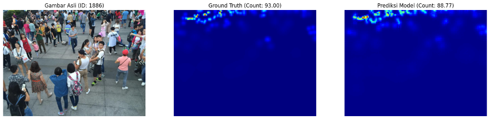
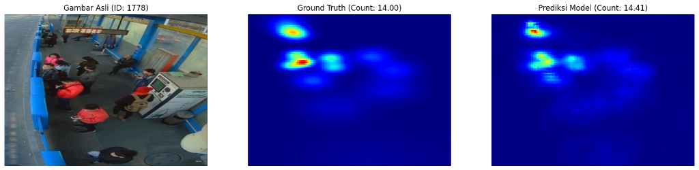

# 🏆 Crowd Counting CSRNet - Hology 8.0 Competition


> **Penyisihan Hology 8.0 2025 – Data Mining Competition**  
> Fakultas Ilmu Komputer, Universitas Brawijaya

## 📊 Competition Results

**Tim Kibahino** achieved **Rank 4 out of 50 teams** across Indonesia with the following scores:

| Metric | Score | Rank |
|--------|-------|------|
| **Private MAE** | **16.54857** | **7** |
| **Public MAE** | **16.37600** | **10** |
| **Visualization & Analysis** | **8/10** | - |
| **Model Development** | **7/10** | - |
| **Final Ranking** | - | **🥉 4th Place** |

## 👥 Team Members

**Tim Kibahino** - Universitas Brawijaya
- Rhendy Japelhendal S. S.
- Gaung Taqwa Indraswara  
- Muhammad Irza Dzulhika

## 🎯 Problem Statement

Festival Harmoni Nusantara membutuhkan sistem crowd counting untuk:
- Memantau potensi **overcrowding** di area publik
- Perencanaan jalur evakuasi yang efektif
- Meningkatkan keselamatan pengunjung
- Analisis kepadatan kerumunan secara real-time

**Challenge**: Membangun model AI yang dapat menghitung jumlah orang pada citra kerumunan secara akurat dengan variasi:
- Perspektif kamera & skala multi-level
- Kepadatan sangat rendah hingga sangat tinggi  
- Variasi pencahayaan & oklusi

## 🏗️ Model Architecture

### CSRNet (Congested Scene Recognition Network)

Kami menggunakan **CSRNet** dengan arsitektur berikut:

```
Input Image
    ↓
VGG-16 Frontend (Pretrained on ImageNet)
    ↓
Dilated Convolution Backend
    ↓
Density Map Output (1 channel)
    ↓
Sum → Crowd Count
```

**Key Components**:
- **Frontend**: VGG-16 (first 10 convolutional layers) - Feature extraction
- **Backend**: Dilated convolution stack - Capture multi-scale context
- **Output**: Single-channel density map representing crowd spatial distribution

### Why CSRNet?

1. **Handles Scale Variation**: Dilated convolutions provide large receptive fields
2. **Robust to Occlusion**: Density-based approach vs. detection-based
3. **Accurate on Dense Crowds**: Better than traditional counting methods
4. **State-of-the-art**: Proven performance on benchmark datasets

## 🔬 Methodology

### 1. Data Preprocessing

```python
# Adaptive Gaussian Kernel for Density Map
- Sigma based on K-nearest neighbors
- Handles varying crowd density
- Fixed geometry kernel approach
```

**Dataset Structure**:
- **Training**: 1,900 crowd images + JSON annotations (head positions)
- **Test**: 500 crowd images  
- **Annotations**: Point annotations converted to continuous density maps

### 2. Training Strategy

| Parameter | Value |
|-----------|-------|
| **Hardware** | Kaggle P100 GPU |
| **Training Time** | ~12 hours |
| **Optimizer** | Adam |
| **Loss Function** | MSE (Mean Squared Error) & MAE (Mean Absolute Error) |
| **Seed** | Fixed for reproducibility |
| **Augmentation** | Random crop, flip |

**Custom Enhancements**:
- ✅ Weighted loss for high-density regions
- ✅ Adaptive learning rate scheduler
- ✅ Gradient clipping for stability
- ✅ Early stopping with validation monitoring

### 3. Evaluation Metric

**Mean Absolute Error (MAE)**:

```
MAE = (1/N) × Σ|yᵢ - ŷᵢ|
```

Where:
- N = number of test samples
- yᵢ = ground truth count
- ŷᵢ = predicted count

## 📈 Results & Visualizations

### Model Performance

Our CSRNet achieved consistent performance across various crowd densities:

#### Example 1: Low Density Crowd (Count: 14)


#### Example 2: High Density Crowd (Count: 93)


#### Example 3: Medium Density Crowd


**Key Observations**:
- ✅ Accurate predictions across different density levels
- ✅ Robust density map generation
- ✅ Handles occlusion and perspective variation
- ✅ Low MAE (16.55) demonstrates model reliability

## 📁 Project Structure

```
Hology/
│
├── Kibahino_Hologyy_Data_Mining.ipynb  # Main notebook
├── README.md                            # This file
├── visualization_*.png                  # Result visualizations
│
└── [Pretrained weights will be added]
```

## 🚀 Quick Start

### Prerequisites

```bash
# Python environment (Kaggle default: Python 3.x)
pip install torch torchvision
pip install numpy pandas matplotlib
pip install opencv-python pillow
pip install scipy h5py
```

### Running the Notebook

1. **Clone this repository**
```bash
git clone [your-repo-url]
cd Hology
```

2. **Download dataset** from [Kaggle Competition](https://www.kaggle.com/competitions/penyisihan-hology-8-0-2025-data-mining/data)

3. **Open Jupyter Notebook**
```bash
jupyter notebook Kibahino_Hologyy_Data_Mining.ipynb
```

4. **Run all cells** (or use Kaggle Notebook interface)

### Dataset Format

**Training Labels (JSON)**:
```json
{
  "img_id": "1.jpg",
  "human_num": 25,
  "points": [[120, 45], [340, 78], [567, 123]]
}
```

**Submission Format (CSV)**:
```csv
image_id,predicted_count
test_0001.jpg,17
test_0002.jpg,42
```

## 🔑 Key Features

### 1. Reproducible Pipeline
- ✅ Fixed random seeds
- ✅ Documented preprocessing steps
- ✅ Clear code structure with markdown explanations

### 2. Comprehensive Analysis
- 📊 Exploratory Data Analysis (EDA)
- 📈 Per-density range evaluation
- 🎨 Density map visualizations
- 📉 Training loss monitoring

### 3. Robust Implementation
- 🔧 Adaptive Gaussian kernel (K-NN based sigma)
- 🎯 Custom loss weighting
- 📏 Gradient clipping
- ⚡ Efficient density map preprocessing

## 🎓 Technical Highlights

### Research & Problem Analysis

Our approach was based on thorough research:

1. **Problem Understanding**: Studied crowd counting literature and state-of-the-art methods
2. **Architecture Selection**: CSRNet chosen for its proven performance on dense crowds
3. **Custom Adaptations**: 
   - Weighted loss for imbalanced density distribution
   - Adaptive kernel sizing based on local crowd density
   - Preprocessing pipeline optimization

### Model Customization

- **Density Map Generation**: Adaptive sigma based on K-nearest neighbors
- **Loss Function**: Custom weighted MSE focusing on high-density regions
- **Data Augmentation**: Carefully designed to preserve crowd characteristics

## 📊 Competition Insights

**What worked well**:
- ✅ CSRNet architecture choice
- ✅ Comprehensive visualization and analysis (8/10 score)
- ✅ Reproducible and well-documented notebook
- ✅ Adaptive density map generation

**Lessons Learned**:
- 💡 Importance of visualization for judge evaluation
- 💡 Balance between model performance and code documentation
- 💡 Custom dataset requires careful preprocessing

## 🔮 Future Improvements

Potential enhancements for better performance:

1. **Ensemble Methods**: Combine multiple CSRNet models
2. **Advanced Augmentation**: Perspective transformation, lighting variation
3. **Attention Mechanisms**: Focus on high-density regions
4. **Multi-scale Fusion**: Better handle scale variations
5. **Post-processing**: Optimize count extraction from density maps

## 📚 References

1. **CSRNet Paper**: Li, Y., Zhang, X., & Chen, D. (2018). *CSRNet: Dilated Convolutional Neural Networks for Understanding the Highly Congested Scenes*. CVPR 2018.
2. **Competition**: [Hology 8.0 - Data Mining](https://www.kaggle.com/competitions/penyisihan-hology-8-0-2025-data-mining)

## 📄 License

This project is licensed under the MIT License - see below for details:

```
MIT License

Copyright (c) 2025 Tim Kibahino - Universitas Brawijaya

Permission is hereby granted, free of charge, to any person obtaining a copy
of this software and associated documentation files (the "Software"), to deal
in the Software without restriction, including without limitation the rights
to use, copy, modify, merge, publish, distribute, sublicense, and/or sell
copies of the Software, and to permit persons to whom the Software is
furnished to do so, subject to the following conditions:

The above copyright notice and this permission notice shall be included in all
copies or substantial portions of the Software.

THE SOFTWARE IS PROVIDED "AS IS", WITHOUT WARRANTY OF ANY KIND, EXPRESS OR
IMPLIED, INCLUDING BUT NOT LIMITED TO THE WARRANTIES OF MERCHANTABILITY,
FITNESS FOR A PARTICULAR PURPOSE AND NONINFRINGEMENT. IN NO EVENT SHALL THE
AUTHORS OR COPYRIGHT HOLDERS BE LIABLE FOR ANY CLAIM, DAMAGES OR OTHER
LIABILITY, WHETHER IN AN ACTION OF CONTRACT, TORT OR OTHERWISE, ARISING FROM,
OUT OF OR IN CONNECTION WITH THE SOFTWARE OR THE USE OR OTHER DEALINGS IN THE
SOFTWARE.
```

## 🙏 Acknowledgments

- Fakultas Ilmu Komputer Universitas Brawijaya untuk kompetisi Hology 8.0
- Kaggle untuk platform dan compute resources (P100 GPU)
- CSRNet authors untuk arsitektur yang powerful

---

**⭐ If this project helps you, please give it a star!**

**📧 Contact**: gaungswara44@gmail.com

**🔗 Links**: 
- [Competition Page](https://www.kaggle.com/competitions/penyisihan-hology-8-0-2025-data-mining)
---

*Made by Tim Kibahino - Universitas Brawijaya*
